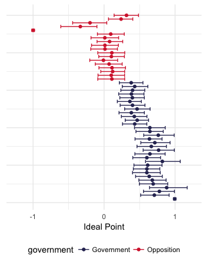

# Bayesian Ideal Point IRT Models in R using Stan

This repo includes data, scripts and [Stan](http://mc-stan.org/) code to run Item Response Theory (IRT) models in R. These models are geared towards analysis of legislative voting data (the scripts can be used for other types of voting data too, for example court decisions). The Stan code can also be easily used in Python with pyStan. The models run for 5000 iterations by default, but this can be changed in the R scripts in the call to `stan()`. 4 cores are used to process 4 chains, which again can be changed in the call to `stan()`. For the dynamic and 2-dimensional models, I recommend up to about 8000 iterations to get good estimates, depending on the data.
The fake data were created in `scripts/create_data.R`. This code and toy dataset are for demonstrating how to build these models only, they are not meant to be high-performing models (you will find convergence issues if you run them with the data provided, for example).

## Repo structure

Example data can be found in `data/`. All R scripts, found in `scripts/`, use this dataset. The IRT model code can be found in `models/`, being `models/Stan/` for the Stan model code. R code for making plots of the results of the modelling stage can be found in `plots/`, with an example run in `saved_runs/`. What it makes (from the one dimensional model):

There is also code for a plot of the two dimensional model in the same script.  

## Models
- One dimensional model (`1d_model_Stan.R`)
- Two dimensional model (`2Dmodel_Stan.R`)
- Dynamic model (`Dynamic_model.R`)
- Hierarchical model (`1d_hierarchical.stan`) (this can also be adapted to have a higher level regression)

## IRT modelling
*Ideal point* IRT models differ from regular IRT models in that the discrimination parameter (the *beta* in y = beta*theta - alpha) in a 2-parameter IRT model cannot be negative, whereas in an ideal point model it can. This is to capture the fact that variation along the latent trait can move in both directions in the political context (for example, along a left-right scale). In regular IRT, this does not make much sense as movement upwards along the scale of the latent trait (usually some type of ability) should be associated with positive movement in levels of the actual unobserved trait, i.e. the more of an ability you have, the more chance of getting a correct response. 

BUGS or JAGS users can find a host of regular IRT models in Ian Curtis' [paper](https://www.google.com/url?sa=t&rct=j&q=&esrc=s&source=web&cd=1&cad=rja&uact=8&ved=0ahUKEwjEk-b0_oLOAhUGDpAKHd4CCjMQFggeMAA&url=https%3A%2F%2Fwww.jstatsoft.org%2Farticle%2Fview%2Fv036c01%2Fv36c01.pdf&usg=AFQjCNEs9TOxtdwHK3wdInSin01WCa-Iyw&sig2=Pg9jjBeFewZIzYaAIE_gTg). 
JAGS is commonly used in the field for this type of model, but I would recommend using Stan, as JAGS can take a *very* long time for even medium-sized datasets (in the non big-data sense, for example 100 voters voting on 200 votes). The reason for this is that JAGS is unable to build a Directed Acyclic Graph from the unobserved regressor in the basic ideal point IRT equation (see [here](https://sourceforge.net/p/mcmc-jags/discussion/610037/thread/5c9e9026/ )).

## Packages
This repo makes use of the [`rstan`](http://mc-stan.org/users/interfaces/rstan) package for R, and also some packages from the [tidyverse](https://www.tidyverse.org/) set of packages for data organisation and plotting. 

## Issues
If you have any problems running the code, or any questions/criticisms/suggestions, please leave an [issue](https://github.com/RobertMyles/IRT/issues) here on the repo.   
